# Legible Shared Autonomy: Implicit Communication of Robot Belief through Motion

---

## Abstract

Shared autonomy systems combine user input with autonomous assistance to help users with motor impairments control robot arms to perform everyday manipulation tasks, by inferring user goals and providing appropriate guidance. However, the robot's internal beliefs about user goals cannot be observed by users. Traditional shared autonomy systems provide assistance along efficient shortest paths toward inferred goals, but when multiple objects lie in similar directions, such assistive motion remains ambiguous and fails to reveal the specific goal identified by the robot. This creates two critical problems. First, when the robot correctly infers the goal, users continue controlling because they cannot perceive understanding from ambiguous assistive motion, wasting effort when autonomous completion would suffice. Second, when the robot misunderstands intent, users cannot quickly detect errors until assistive motion diverges significantly, requiring substantial corrective input. We address this by introducing legible motion into shared autonomy, where robot actions must both advance toward the goal and clearly reveal which goal has been inferred, enabling users to understand the robot's beliefs and adjust control accordingly. The robot modulates communication strength through confidence-aware adaptive authority allocation by providing assertive legible assistive actions when confident while increasing user authority when uncertain, transforming shared autonomy into transparent bidirectional collaboration. User studies including 2D simulation and physical six degree-of-freedom robot arm experiments demonstrate that legible shared autonomy significantly improves users' understanding of robot beliefs and reduces user control effort compared to standard shared autonomy. 

---

## Experimental Setup

  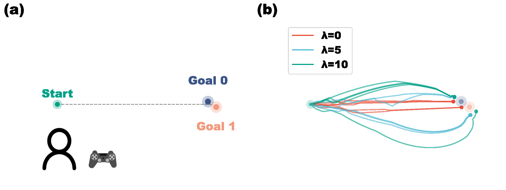

**Design:** Within-subjects study with 20 participants

**Conditions:**
- λ=0 (Standard SA): Efficient but ambiguous motion
- λ=5 (Medium Legibility): Balanced approach  
- λ=10 (High Legibility): Maximum discriminative motion

**Workspace:** 2D environment (800×600 pixels) with two closely spaced goals creating directional ambiguity

---

## Trajectory Animations

<table>
  <tr>
    <td align="center">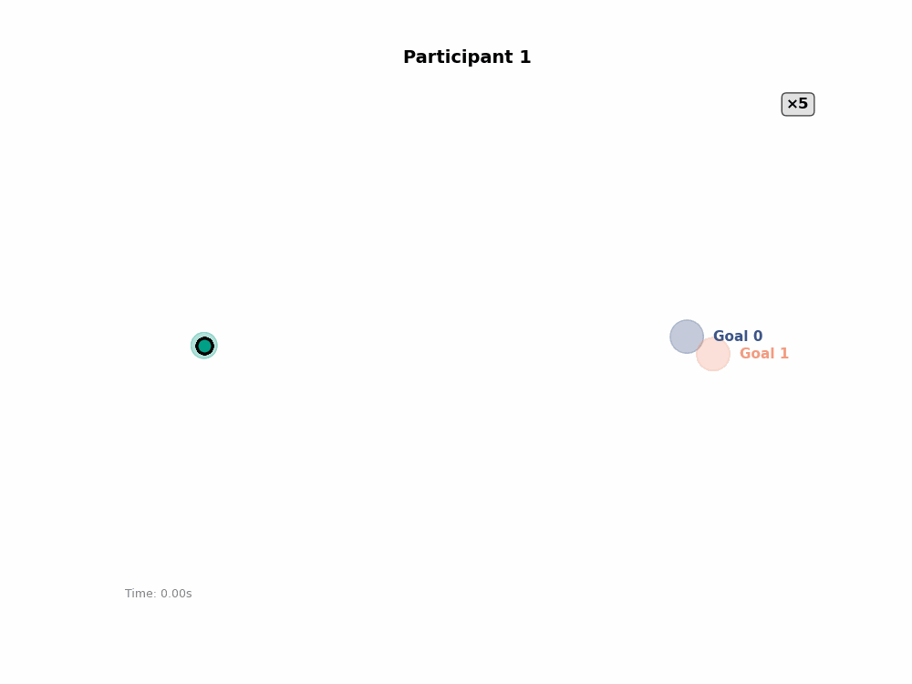 Participant 1</td>
    <td align="center"> Participant 2</td>
    <td align="center"> Participant 3</td>
    <td align="center">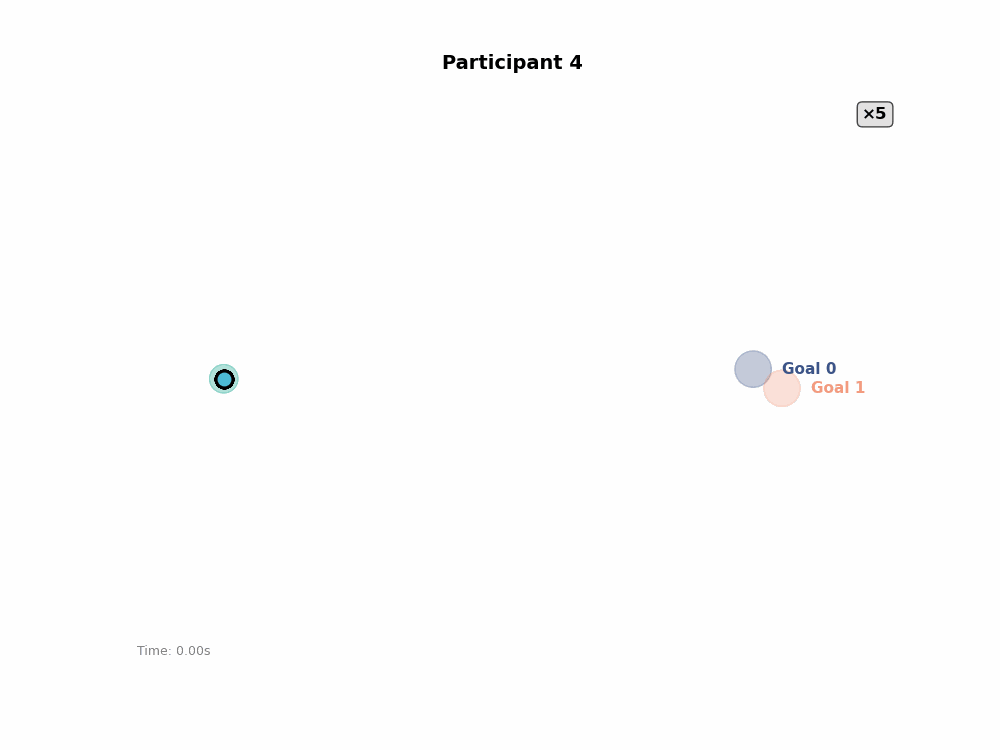 Participant 4</td>
  </tr>
  <tr>
    <td align="center">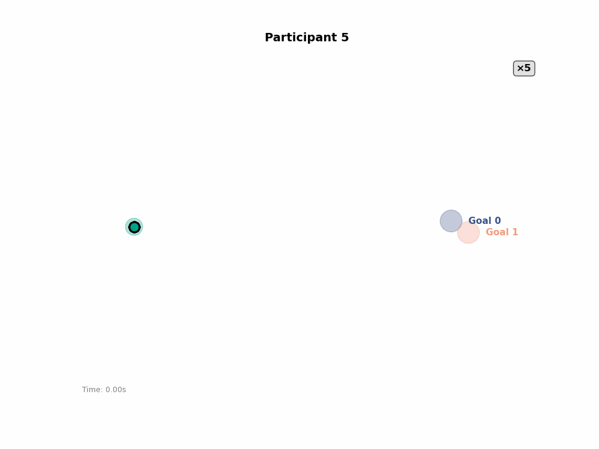 Participant 5</td>
    <td align="center"> Participant 6</td>
    <td align="center"> Participant 7</td>
    <td align="center"> Participant 10</td>
  </tr>
  <tr>
    <td align="center">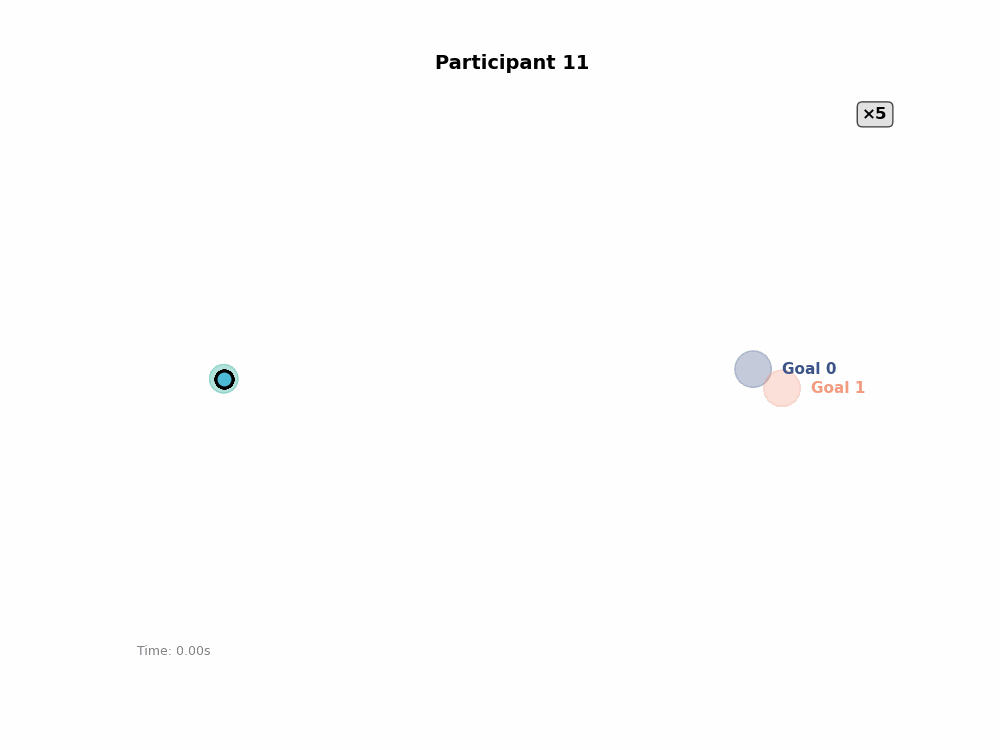 Participant 11</td>
    <td align="center"> Participant 12</td>
    <td align="center">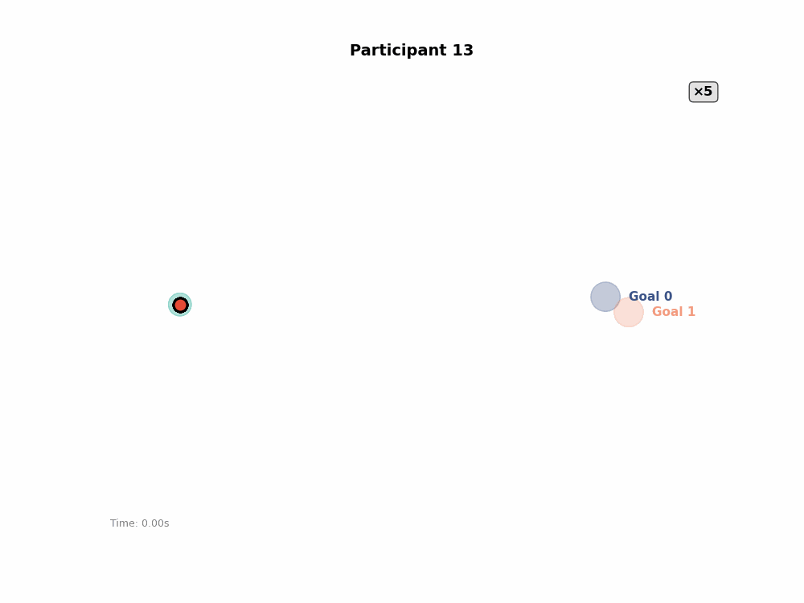 Participant 13</td>
    <td align="center"> Participant 15</td>
  </tr>
  <tr>
    <td align="center">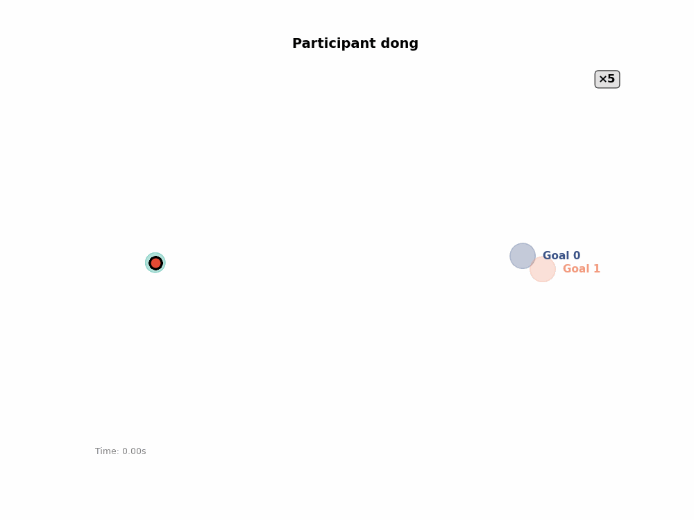 Participant Dong</td>
    <td align="center"> Participant Gong</td>
    <td align="center"> Participant Shuxian</td>
    <td align="center"> Participant Sun</td>
  </tr>
  <tr>
    <td align="center">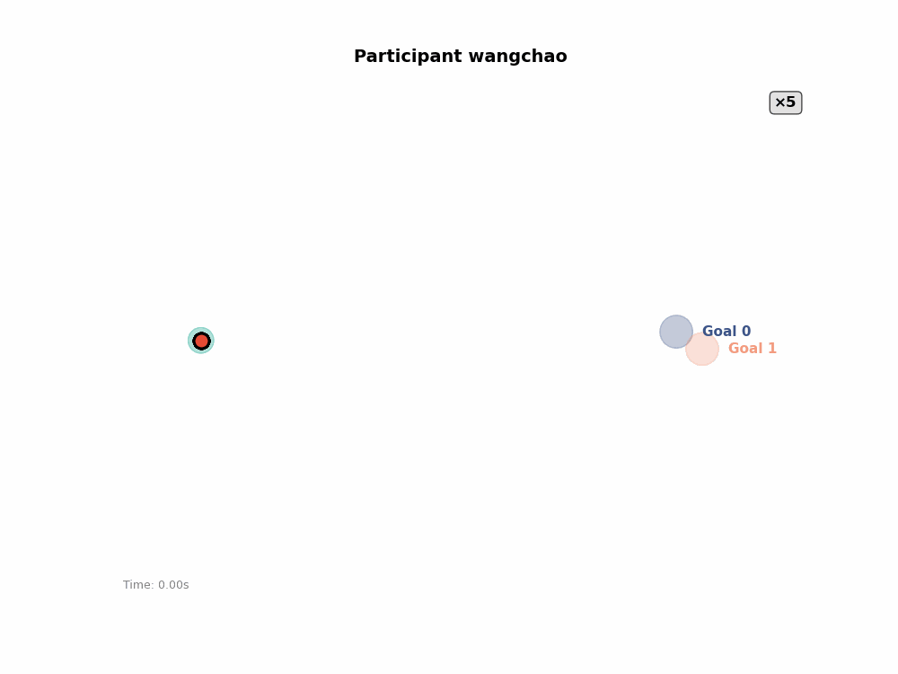 Participant Wangchao</td>
    <td align="center">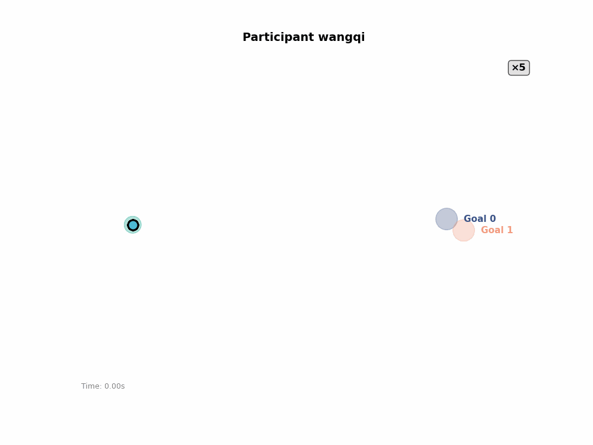 Participant Wangqi</td>
    <td align="center">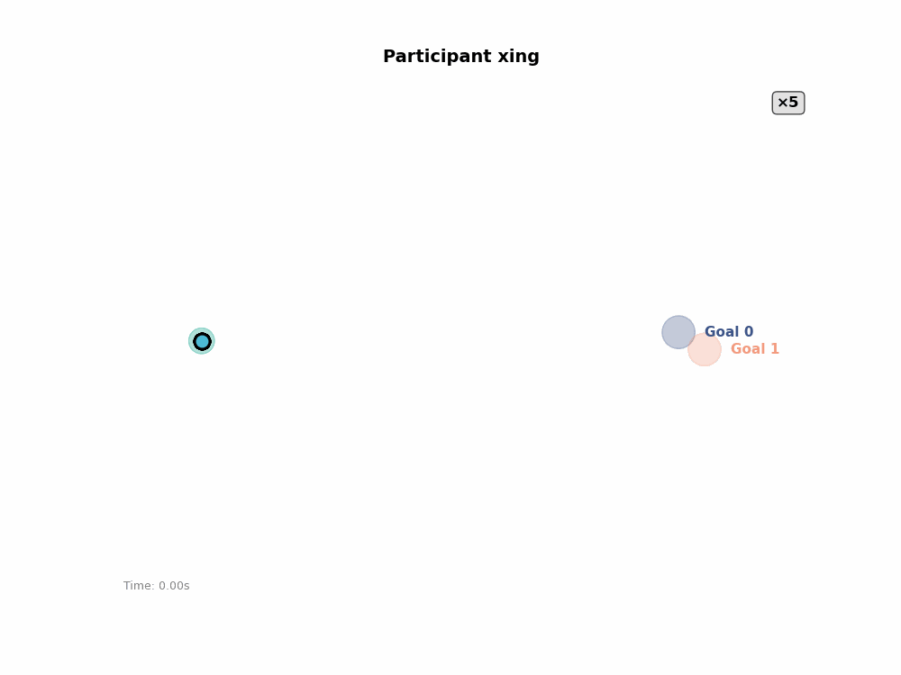 Participant Xing</td>
    <td align="center">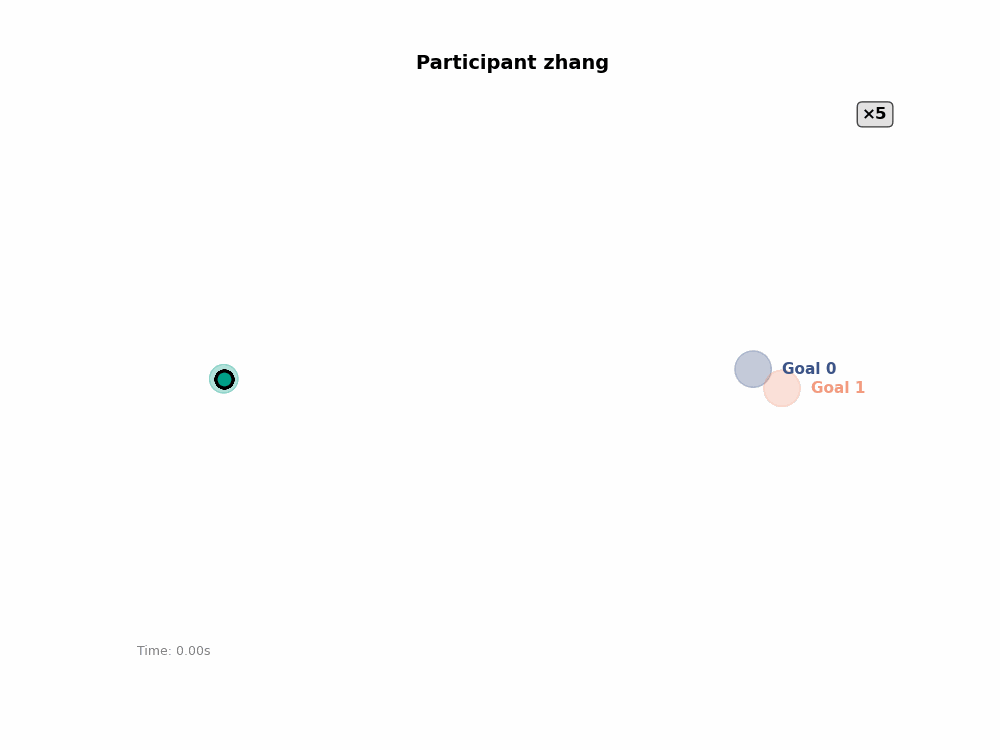 Participant Zhang</td>
  </tr>
</table>

---

## Main Results

  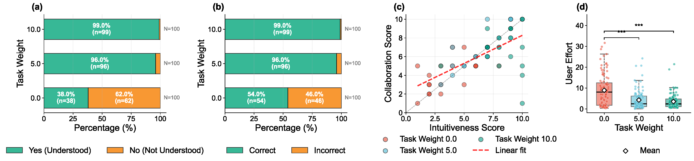

**Transparency Metrics:**
- Understanding rate: 36% → 94-98% (Standard SA → Legible)
- Prediction accuracy: 48% → 96-98%
- Statistical significance: χ²(2) = 66.01, p < 0.001

**Subjective Experience:**
- Intuitiveness ratings: 3.70 → 7.70 (1-10 scale)
- Collaboration ratings: 3.60 → 7.70
- Strong correlation between measures: r = 0.92, p < 0.001

**User Effort (Panel d):**
- Mean user input norm: λ=0: 8.92 ± 7.71 → λ=5: 4.25 ± 4.60 → λ=10: 3.53 ± 3.51
- Legible motion reduces user effort by 52% (λ=5) and 60% (λ=10) vs. standard SA
- Overall effect: Kruskal-Wallis H(2) = 30.68, p < 0.001
- Pairwise tests (Bonferroni-corrected): λ=0 vs λ=5: p < 0.001 (***), λ=0 vs λ=10: p < 0.001 (***), λ=5 vs λ=10: p = 1.000 (ns)
- Both legible conditions significantly outperform standard SA; no significant difference between the two legibility levels
